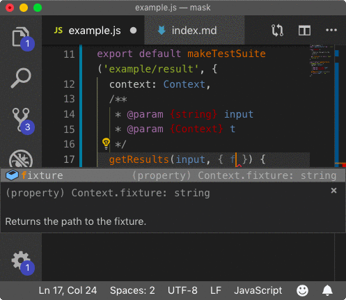

# @zoroaster/mask

[](https://npmjs.org/package/@zoroaster/mask)

`@zoroaster/mask` is The Code For Zoroaster Mask Testing.

```sh
yarn add -E @zoroaster/mask
```

## Table Of Contents

- [Table Of Contents](#table-of-contents)
- [API](#api)
- [`makeTestSuite(result: string, config: MakeTestSuiteConf)`](#maketestsuiteresult-stringconfig-maketestsuiteconf-void)
  * [`MakeTestSuiteConf`](#type-maketestsuiteconf)
- [Testing Forks](#testing-forks)
  * [`ForkConfig`](#type-forkconfig)
- [Enabling JSDoc](#enabling-jsdoc)
- [Copyright](#copyright)

<p align="center"><a href="#table-of-contents"></a></p>

## API

The package is available by importing its default function:

```js
import makeTestSuite from '@zoroaster/mask'
```

<p align="center"><a href="#table-of-contents"></a></p>

## `makeTestSuite(`<br/>&nbsp;&nbsp;`result: string,`<br/>&nbsp;&nbsp;`config: MakeTestSuiteConf,`<br/>`): void`

Creates a test suite that can be exported to run with _Zoroaster_ Context-Testing Framework.

`import('stream').Transform` __<a name="type-transform">`Transform`</a>__

`import('stream').Readable` __<a name="type-readable">`Readable`</a>__

__<a name="type-maketestsuiteconf">`MakeTestSuiteConf`</a>__: Configuration for making test suites.

|       Name        |                                                     Type                                                      |                                                                                                                                                                                       Description                                                                                                                                                                                       |          Default           |
| ----------------- | ------------------------------------------------------------------------------------------------------------- | --------------------------------------------------------------------------------------------------------------------------------------------------------------------------------------------------------------------------------------------------------------------------------------------------------------------------------------------------------------------------------------- | -------------------------- |
| context           | _({new(): Context} \| {new(): Context}[] \| {})_                                                              | Single or multiple context constructors or objects to initialise for each test.                                                                                                                                                                                                                                                                                                         | -                          |
| persistentContext | _({new(): Context} \| {new(): Context}[] \| {})_                                                              | The context constructor(s) that will be initialised and destroyed once per test suite, having a persistent state across tests.                                                                                                                                                                                                                                                          | -                          |
| getResults        | _(input: string, ...contexts?: Context[]) =&gt; string_                                                       | A possibly async function which should return results of a test. If it returns a string, it will be compared against the `expected` property of the mask using string comparison. If it returns an object, its deep equality with `expected` can be tested by adding `'expected'` to the `jsonProps`.                                                                                   | -                          |
| getTransform      | _(...contexts?: Context[]) =&gt; Transform\|Promise.&lt;[Transform](#type-transform)>_                        | A possibly async function which returns a _Transform_ stream to be ended with the input specified in the mask. Its output will be accumulated and compared against the expected output of the mask.                                                                                                                                                                                     | -                          |
| getReadable       | _(input: string, ...contexts?: Context[]) =&gt; Readable\|Promise.&lt;[Readable](#type-readable)>_            | A possibly async function which returns a _Readable_ stream constructed with the input from the mask. Its output will be stored in memory and compared against the expected output of the mask. This could be used to test a forked child process, for example.                                                                                                                         | -                          |
| fork              | _string \| [ForkConfig](#type-forkconfig)_                                                                    | A path to the module to fork with input as arguments, and compare its output against the `code`, `stdout` and `stderr` properties of the mask. Arguments with whitespace should be wrapped in speech marks, i.e. `'` or `"`. Additionally, `ForkConfig` with `module`, `getArgs`, `options` and `getOptions` properties can be passed for more control of how the fork will be started. | -                          |
| getThrowsConfig   | _(input: string, ...contexts?: Context[]) =&gt; { fn: function, args?: any[], message?: (string \| RegExp) }_ | A function which should return a configuration for [`assert-throws`](https://github.com/artdecocode/assert-throws), including `fn` and `args`, when testing an error.                                                                                                                                                                                                                   | -                          |
| mapActual         | _(results: any) =&gt; string_                                                                                 | An optional function to get a value to test against `expected` mask property from results. By default, the full result is used.                                                                                                                                                                                                                                                         | -                          |
| assertResults     | _(results: any, props: Object.&lt;string, (string \| object)&gt; \| ) => (void \| Promise)_                   | A possibly async function containing any addition assertions on the results. The results from `getResults` and a map of expected values extracted from the mask (where `jsonProps` are parsed into JS objects) will be passed as arguments.                                                                                                                                             | -                          |
| jsonProps         | _string[]_                                                                                                    | Any additional properties to extract from the mask, and parse as _JSON_ values.                                                                                                                                                                                                                                                                                                         | -                          |
| splitRe           | _RegExp_                                                                                                      | A regular expression used to detect the beginning of a new test in a mask result file. The default is `/^\/\/ /gm` for results from all files, and `/^## /gm` for results from `.md` files.                                                                                                                                                                                             | `/^\/\/ /gm` or `/^## /gm` |
| propStartRe       | _RegExp_                                                                                                      | The regex to detect the start of the property, e.g., in `/⁎ propName ⁎/` it is the default regex that detects `/⁎`. There's no option to define the end of the regex after the name. [If copying, replace `⁎` with `*`].                                                                                                                                                                | `\/\‎⁎`                    |
| propEndRe         | _RegExp_                                                                                                      | The regex which idicates the end of the property, e.g, in `/⁎ propName ⁎/ some prop value /⁎⁎/` it is the default that detects `/⁎⁎/`. [If copying, replace `⁎` with `*`].                                                                                                                                                                                                              | `/\/\⁎\⁎\//`               |

_For example, given the following function:_

```js
import { read } from '@wrote/wrote'

/**
 * An example function that reads a file.
 * @param {string} path The path to the file to read.
 * @param {string} input The string to prepend.
 */
const fn = async (path, input) => {
  const res = await read(path)
  return `${input}: ${res}`
}

export default fn
```

_Zoroastser can test it using a mask:_

```js
/* yarn example/ */
import makeTestSuite from '@zoroaster/mask'
import fn from '../../src'

class Context {
  /**
   * Returns the path to the fixture.
   */
  get fixture() { return 'example/test/fixture/test.txt' }
}

export default makeTestSuite('example/test/result', {
  context: Context,
  /**
   * @param {string} input
   * @param {Context} t
   */
  async getResults(input, { fixture }) {
    const res = await fn(fixture, input)
    return res
  },
})
```
```
example/test/mask/default.js
  ✓  runs the test
not hello world: this is a test
  ✗  fails the test
  | Error: 'hello world: this is a test' == 'not hello world: this is a test'
  |     at fails the test (example/test/result/default.md:8:1)

example/test/mask/default.js > fails the test
  Error: 'hello world: this is a test' == 'not hello world: this is a test'
      at fails the test (example/test/result/default.md:8:1)

🦅  Executed 2 tests: 1 error.
```

<p align="center"><a href="#table-of-contents"></a></p>

## Testing Forks

With masks, it is very easy to test fork processes.

`import('child_process').ForkOptions` __<a name="type-forkoptions">`ForkOptions`</a>__

__<a name="type-forkconfig">`ForkConfig`</a>__: Parameters for forking.

|      Name      |                                       Type                                        |                                                                                      Description                                                                                      | Default |
| -------------- | --------------------------------------------------------------------------------- | ------------------------------------------------------------------------------------------------------------------------------------------------------------------------------------- | ------- |
| __module*__    | _string_                                                                          | The path to the module to fork.                                                                                                                                                       | -       |
| getArgs        | _(args: string[], ...contexts?: Context[]) =&gt; string[]\|Promise.&lt;string[]>_ | The function to get arguments to pass the fork based on the parsed mask input and contexts.                                                                                           | -       |
| getOptions     | _(...contexts?: Context[]) =&gt; ForkOptions_                                     | The function to get options for the fork, such as `ENV` and `cwd`, based on contexts.                                                                                                 | -       |
| options        | _[ForkOptions](#type-forkoptions)_                                                | Options for the forked processed, such as `ENV` and `cwd`.                                                                                                                            | -       |
| inputs         | _[RegExp, string][]_                                                              | Inputs to push to `stdin` when `stdout` writes data. The inputs are kept on stack, and taken off the stack when the RegExp matches the written data.                                  | -       |
| stderrInputs   | _[RegExp, string][]_                                                              | Inputs to push to `stdin` when `stderr` writes data (similar to `inputs`).                                                                                                            | -       |
| log            | _boolean \| {stderr: Writable, stdout: Writable}_                                 | Whether to pipe data from `stdout`, `stderr` to the process's streams. If an object is passed, the output will be piped to streams specified as its `stdout` and `stderr` properties. | `false` |
| includeAnswers | _boolean_                                                                         | Whether to add the answers to the `stderr` and `stdout` output.                                                                                                                       | `true`  |
| stripAnsi      | _boolean_                                                                         | Remove ANSI escape sequences from the `stdout` and `stderr` prior to checking of the result.                                                                                          | `true`  |
| preprocess     | _(function \| {stdout?:function, stderr?:function})_                              | The function to run on `stdout` and `stderr` before comparing it to the output. Pass an object with `stdout` and `stderr` properties for individual pre-processors.                   | -       |

<p align="center"><a href="#table-of-contents"></a></p>

## Enabling JSDoc

The JSDoc for contexts can be enabled by specifying types for the params to the functions.



<p align="center"><a href="#table-of-contents"></a></p>

## Copyright


  (c) [Context Testing](https://contexttesting.com) 2019


<p align="center"><a href="#table-of-contents"></a></p>